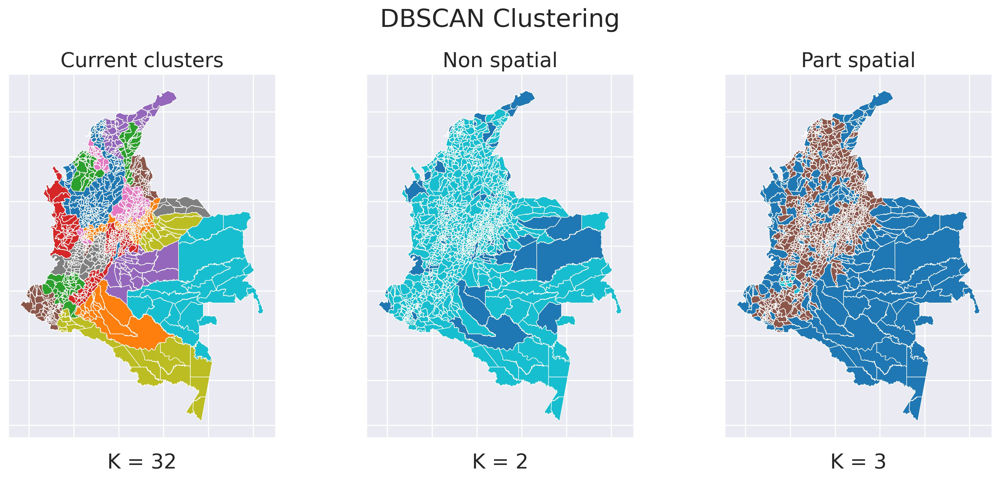
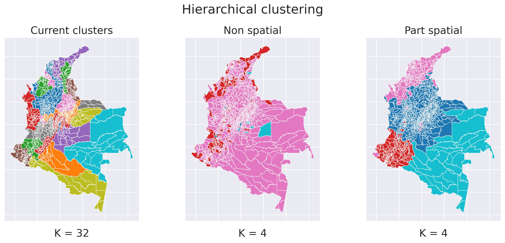
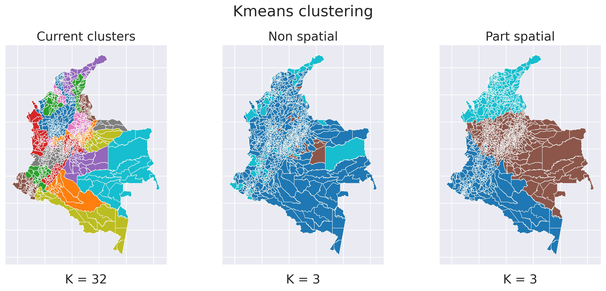
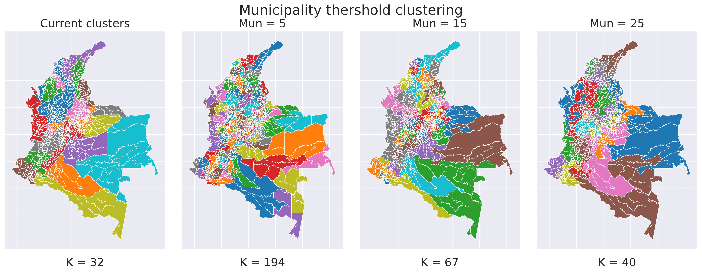
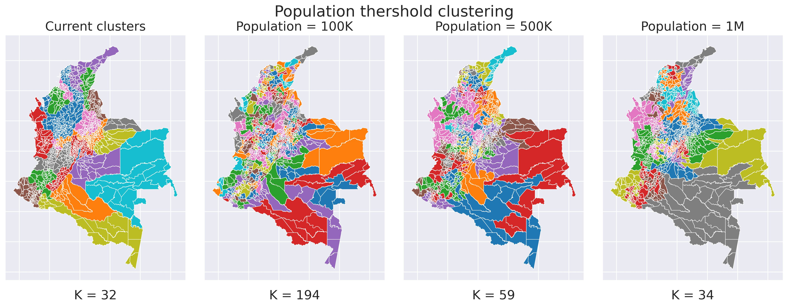

# Municipality Clustering - Data Science for Spatial Systems Assessment

Author: [Andrés Restrepo Jiménez](https://www.linkedin.com/in/andres-restrepo-jimenez/)

Repo containing code of assessment of Data Science for Spatial Systems course from MSc Urban Spatial Science at [The Bartlett Centre for Advanced Spatial Analysis](https://www.ucl.ac.uk/bartlett/casa/) of [University College London](https://www.ucl.ac.uk/).

The code support a academic research exercise to perform spatial and non-spatial clustering technics to assess the current administrative municipality clustering.

## Results

### DBSCAN Clustering

### Hierarchical Clustering

### Kmeans Clustering

### Spatial Clusteing using municipality threshold

### Spatial Clusteing using population threshold
